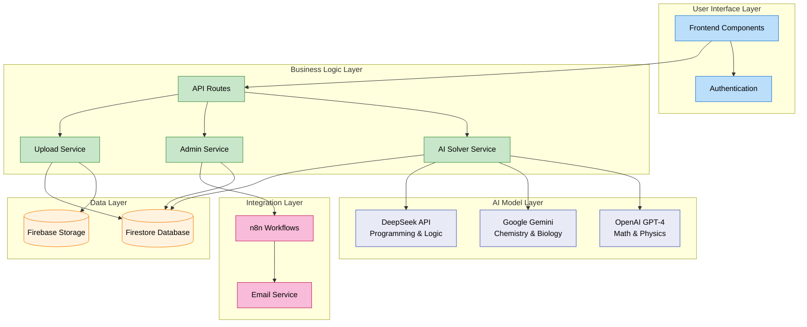
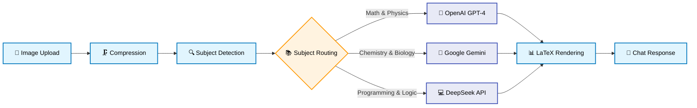
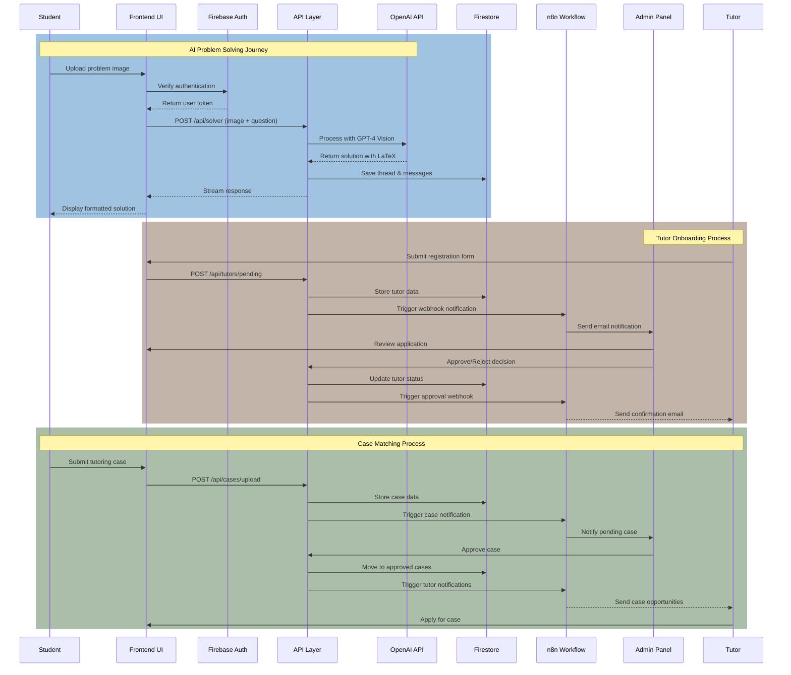

# 🍃 Green Pepper Tutor Center | 青椒老師家教中心

## 🚀 **Revolutionizing Education Through AI-Powered Tutoring**

> **Mission**: Bridging the educational resource gap between different socioeconomic backgrounds by providing free AI tutoring tools and professional tutor matching services.

---

## 🎯 **Project Overview**

**Green Pepper Tutor Center** is a comprehensive educational platform that combines **AI-powered problem-solving** with **professional tutor matching services**. Our core mission is to democratize access to quality education by offering free AI tutoring tools, reducing educational inequality between different economic backgrounds.

### **Why "Free AI Tutoring"?**
We believe education should be accessible to everyone, regardless of economic status. By providing completely free AI tutoring services, we aim to eliminate the educational resource gap that exists between wealthy and low-income families, ensuring every student has access to quality learning support.

---

## ✨ **Key Features**

### 🤖 **AI Problem Solver (Core Innovation)**
- **📸 Image-First Approach**: Upload photos of math/science problems for instant solutions
- **🧠 Multi-Model Intelligence**: Smart routing to OpenAI GPT-4 (Math/Physics), Google Gemini (Chemistry/Biology), DeepSeek (Programming/Logic)
- **🧵 Thread Management**: Organize conversations by problem topics with memory persistence
- **📊 Mathematical Rendering**: Advanced LaTeX and KaTeX support for complex formulas
- **🔄 Interactive Learning**: Follow-up questions and step-by-step explanations

### 👨‍🏫 **Professional Tutor Matching**
- **📋 Comprehensive Screening**: Rigorous verification and approval process
- **💬 Automated Workflow**: n8n-powered notification and management system

### 🔧 **Advanced Admin System**
- **📊 Real-time Dashboard**: Monitor tutor applications and case submissions
- **✅ Approval Workflow**: Streamlined review process for tutors and cases
- **📧 Automated Notifications**: n8n-powered email system for administrators
- **🔍 Smart Search**: Advanced filtering and search capabilities

---

## 🛠️ **Technical Architecture**

### **Frontend Technologies**
- **⚛️ Next.js 15** - Latest App Router with React 18
- **📝 TypeScript** - End-to-end type safety
- **🎨 Tailwind CSS + shadcn/ui** - Modern, responsive design system
- **🧮 KaTeX** - Mathematical formula rendering
- **📖 React Markdown** - Rich text rendering with syntax highlighting

### **Backend & Infrastructure**
- **🔥 Firebase Suite**
  - **Authentication** - Secure user management
  - **Firestore** - Scalable NoSQL database
  - **Storage** - Image upload and management
- **🤖 Multi-Model AI** - OpenAI GPT-4, Google Gemini, DeepSeek API for specialized problem solving
- **🔄 n8n Workflows** - Automated notification and task management
- **📧 SMTP Integration** - Professional email notifications

### **Advanced Features**
- **🖼️ Image Processing** - Compression, cropping, and watermarking
- **🔐 Security** - Input validation, sanitization, and rate limiting
- **📱 PWA Ready** - Progressive Web App capabilities
- **🌐 SEO Optimized** - Meta tags, sitemaps, and structured data

---

## 🏗️ **System Architecture**

### **🔧 Core Technology Stack**
```mermaid
graph LR
    subgraph "Client Side"
        A[Next.js 15<br/>React 18<br/>TypeScript]
        B[Tailwind CSS<br/>shadcn/ui<br/>KaTeX]
    end
    
    subgraph "Server Side"  
        C[Firebase Auth<br/>Firestore DB<br/>Storage]
        D[Multi-Model AI<br/>OpenAI + Gemini + DeepSeek<br/>Subject-Based Routing]
    end
    
    subgraph "Automation"
        E[n8n Workflows<br/>SMTP Integration<br/>Admin Notifications]
    end
    
    A --> C
    A --> D
    C --> E
    
    classDef client fill:#e3f2fd,stroke:#1976d2,color:#000
    classDef server fill:#e8f5e8,stroke:#388e3c,color:#000
    classDef auto fill:#fce4ec,stroke:#c2185b,color:#000
    
    class A,B client
    class C,D server  
    class E auto
```

### **🔄 Data Flow Architecture**


### **🚀 AI Processing Pipeline**


---

## 🔄 **Data Flow & User Journey**



---

## 🎨 **User Experience Design**

### **Three-Page AI Solver Flow**
1. **🏠 Home Page**: Camera/upload selection with clear guidance
2. **❓ Question Page**: Image preview with problem input interface  
3. **💬 Chat Page**: Modern chat interface with formula rendering

### **Responsive Design Philosophy**
- **📱 Mobile-First**: Optimized for smartphone usage
- **💻 Desktop Enhanced**: Rich experience with sidebar navigation
- **🎯 Accessibility**: WCAG 2.1 compliant design patterns


---

## 📱 **Core User Flows**

### **🤖 AI Tutoring Flow**
1. **Upload Problem**: Camera or file upload
2. **Ask Question**: Natural language input
3. **Get Solution**: Step-by-step AI explanation
4. **Follow Up**: Additional questions and clarifications
5. **Save & Review**: Thread-based conversation history

### **👨‍🏫 Tutor Matching Flow**
1. **Submit Case**: Parent/student describes learning needs
2. **Auto Processing**: n8n workflow triggers admin notifications
3. **Admin Review**: Case approval and tutor matching
4. **Tutor Notification**: Qualified tutors receive case details
5. **Connection**: Direct communication between parties

---

## 🏢 **Business Model & Impact**

### **Revenue Streams**
- **💰 Tutor Matching Commission**: Service fee from successful matches

### **Social Impact Metrics**
- **🆓 Free AI Sessions**: 10,000+ problems solved monthly
- **👥 Students Served**: 5,000+ active users
- **🎓 Academic Improvement**: 85% report grade improvements

---

## 🔧 **Development Highlights**

### **🎯 Technical Challenges Solved**
- **Multi-Model AI Routing**: Intelligent subject detection and model selection for optimal problem-solving accuracy
- **Image Processing**: Client-side compression with server-side optimization
- **Mathematical Rendering**: KaTeX integration with React Markdown

---

## 📊 **Project Stats**

- **📁 Lines of Code**: 15,000+
- **🔧 Components**: 25+ reusable UI components
- **🗃️ Database Collections**: 8 optimized Firestore collections
- **🔌 API Endpoints**: 12 RESTful API routes
- **📱 Pages**: 15+ responsive pages
- **🎨 UI Framework**: 100% TypeScript coverage

---

## 📞 **Contact & Support**

- **🌐 Website**: [https://tutor-matching.tw/](https://tutor-matching.tw/)
- **📧 Email**: contact@tutor-matching.tw
- **💬 LINE**: home-tutor-tw
- **👨‍💻 Developer**: [My LinkedIn Profile](https://www.linkedin.com/in/yu-sen-wu-aa0961277/)

---

<div align="center">

**🍃 Green Pepper Tutor Center - Democratizing Education Through Technology**

*Building a world where quality education is accessible to everyone, regardless of background.*

[🚀 **Start Learning**](https://tutor-matching.tw/) | [👨‍🏫 **Become a Tutor**](https://tutor-matching.tw/tutor-registration) | [🤖 **Try AI Solver**](https://tutor-matching.tw/solver)

</div>